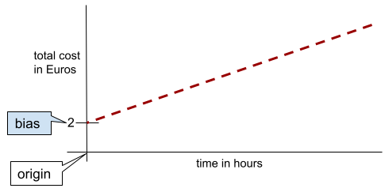

Antes de entendermos o que é uma regressão linear, precisamos entender:

## Bias

Bias - É um número que é adicionado depois da multiplicação dos valores de entrada e pesos, ele 
serve como ponto de partida para que a função possa ser aplicada de maneira ótima.

Exemplo: Se a função tenta demonstrar o valor de um carro ao decorrer dos anos, o bias teria que
ser positivo, já que o valor do carro não pode ser negativo em nenhum momento.

o Bias existe para servir como um ponto de início.



## Peso

Peso - É o multiplicador que o número de entrada recebe, é o que determina a influência de cada 
valor no resultado final.

## Regressão linear

A regressão linear é uma técnica que visa traçar uma linha ideal que possa ser o mais próximo possível 
de todos os pontos de dados que estão sendo analisados.

Matemáticamente falando, a regressão linear é descrita pela seguinte função algébrica:

$$
\hat{y} = b + x \cdot w
$$

onde:

* esse Y com chapéu estranho é o resultado em que queremos chegar
* b - é o bias, ou viés
* x - é o valor de entrada
* w - é o peso atribuído ao valor de entrada

# Funções de perda.

A perda no contexto de estatística e aprendizado de máquina, é uma métrica usada para avaliar a distância entre o resultado
previsto, e o resultado final.

Um adendo importante é que a perda se importa com a diferença entre os valores, e não na direção, ou seja
**TODOS** os resultados de uma função de perda serão não negativos (positivos + 0), já que na matemática, o sinal pode representar a direção em um eixo.

Durante o treinamento, os valores de B e W são ajustados para diminuir a distância entre os valores 
previstos e valores reais.

## Tipos de funções de perda


### Loss (L1): 
Essa é a soma dos valores absolutos (ou seja, só valores positivos) da diferença entre os 
valores previstos e valores reais.

$$ 
\sum_{i=1}^{n} |valor real - valor previsto|
$$

ou para os programadores de plantão:

```python

valores_reais = [1,2,3]
valores_previstos = [4,5,6]

loss = 0

for real_value, predicted_value in zip(valores_reais, valores_previstos):
    loss += abs(real_value - predicted_value)

print(loss)
```

Em geral, o L1 tende a **zerar** pesos de variáveis menos importantes para o cálculo,
supondo que o conjunto de dados tem muitas features (ou seja, colunas ou campos do dataset), 
o L1 também conhecido como lasso vai eliminar o peso das variáveis que menos afetam o resultado final.

Idealmente, o L1 deve ser usado quando temos muitas features de alta e baixa qualidade misturadas.
Entretanto, o Lasso tende a performar mal em casos de overfitting comparado com o L2


---

### Squared Loss (L2)

O L2 é bem parecido com o L1, com a diferença que o loss é elevado ao quadrado.

$$
\sum_{i=1}^{n} = (valor real - valor previsto)^2
$$

O L2 ou Ridge tende a dividir bem os pesos entre as variáveis, seu uso é recomendado
em casos de risco de overfitting

---

### Erro médio absoluto (MAE):

O erro médio absoluto não é nada mais nada menos que a média de loss.

$$
\frac{1}{n} \sum_{i=1}^{n} |valor real - valor previsto|
$$

ou em python:

```python


valores_reais = [1,2,3]
valores_previstos = [4,5,6]

loss = 0

for real_value, predicted_value in zip(valores_reais, valores_previstos):
    loss += abs(real_value - predicted_value)

# O loss é dividido pela quantidade de dados
loss = loss / len(valores_reais)

```

O MAE é usado para penalizar todos os erros igualmente, ele performa muito bem
em conjuntos com muitos outliers, ou seja, conjuntos que existem muitos pontos fora da curva

O MSE move o modelo mais para os valores discrepantes

### Erro quadrático medio (MSE):

Assim como L1 está para L2, MAE está para MSE.

$$
\frac{1}{n} \sum_{i=1}^{n} (valor real - valor previsto)^2
$$

Então basta elevar ao quadrado antes de fazer a média.

O MSE é usado para penalizar fortemente os erros como um todo,
ele é usado para tentar alcançar eficiencia máxima no conjunto,
tendo um alto risco de overfitting e de ser influenciado por outliers,
já que o MSE move a linha para perto dos valores discrepantes.

---
